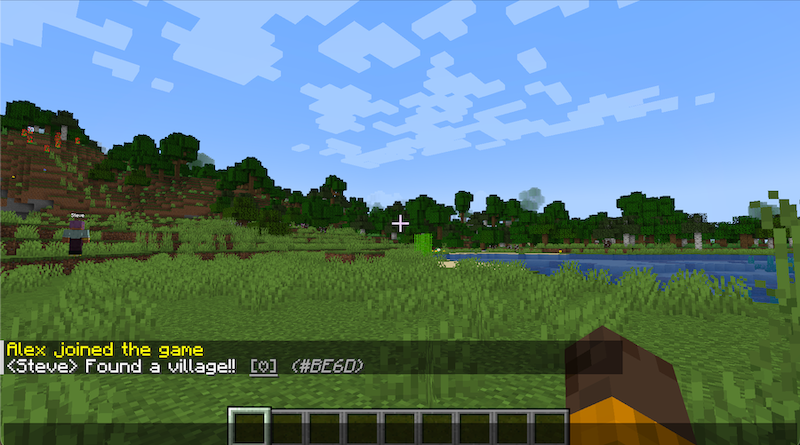

# LikeBeacon

A Minecraft Paper plugin that encourages positive interactions by allowing players to send direct Likes, like ordinary chat messages, and react to items in a unified feed.

LikeBeacon provides a lightweight social system with feeds, rankings, personal statistics, and multilingual support, helping communities recognize and celebrate positive moments.

---

# Features

* ❤️ Send Likes to other players with a custom message
* 💬 Like ordinary chat messages using a per-viewer clickable `[♡]` control
* ⬆️ Promote a chat message to the feed only when it receives its first Like; unliked messages are not persisted
* ❤️ React to feed items using clickable controls or display codes, which are always available through `/like log` and can optionally be shown in regular messages
* 📖 Browse the unified DIRECT/CHAT feed (in-game book UI, up to 40 entries)
* 🏆 View player rankings: top receivers, top direct givers, and most-reacted feed items (book UI)
* 👤 View your personal Like statistics with received, sent, and reacted counts (book UI)
* 🧾 Quick chat log of the 5 most recent feed items (`/like log`)
* 🔔 Contextual confirmations and recipient notifications for every successful Like
* 🔔 Server-wide announcement for direct Likes with a clickable reaction control
* ✨ Recipient particle effects (heart + firework) when Like notifications arrive
* 🛡️ Daily Like limit and per-pair cooldown to prevent spam
* 🌐 Multi-language support — locale auto-detected from each player's client (English and Japanese)
* 🖥️ Per-server data isolation via `server-id` for multi-server networks
* 💾 SQLite-based persistent storage
* ⚡ Lightweight and optimized for Paper

---

# Screenshots


---

# Commands

All commands require the `likebeacon.use` permission (granted to all players by default).

| Command                        | Description                                    |
| ------------------------------ | ---------------------------------------------- |
| `/like <player> <reason...>`   | Send a Like to another player                  |
| `/like #<code>`                | Like a pending chat or react to a feed item    |
| `/like feed`                   | Open the recent unified feed (book UI)         |
| `/like ranking`                | Open the ranking screen (book UI)              |
| `/like mine`                   | View your personal Like statistics (book UI)   |
| `/like log`                    | Show the 5 most recent feed items in chat      |

## Permissions

| Permission                  | Default   | Description                      |
| --------------------------- | --------- | -------------------------------- |
| `likebeacon.use`            | Everyone  | Use all `/like` commands         |
| `likebeacon.admin`          | Operators | Admin access                     |
| `likebeacon.limit.bypass`   | Operators | Bypass the daily Like limit      |

## Tab Completion

`/like` supports tab completion for:

* Subcommands: `feed`, `log`, `ranking`, `mine`
* A `#` entry point that expands to recent display codes after it is entered or selected
* Online player names

---

# Installation

## Requirements

* Java 21 or later
* Paper 1.21.4 or later (1.21.x)

## Steps

1. Download the latest release JAR.
2. Copy it into your server's `plugins/` directory.
3. Start or restart the Paper server.
4. Edit `plugins/LikeBeacon/config.yml` to configure the plugin (optional).
5. Reload or restart the server if you changed the config.

---

# Configuration

The plugin generates `plugins/LikeBeacon/config.yml` automatically on first run with the following defaults.

| Key                          | Default   | Description                                                                                                                     |
| ---------------------------- | --------- | ------------------------------------------------------------------------------------------------------------------------------- |
| `server-id`                  | `default` | Unique identifier to scope all Like data per server. Set a different value on each server in a multi-server network.            |
| `limits.dailyDirectLikeLimit`| `20`      | Maximum number of Likes a player can send per day (UTC). Bypassed by the `likebeacon.limit.bypass` permission.                 |
| `limits.pairCooldownSeconds` | `60`      | Cooldown in seconds before the same player can Like the same target again. Resets on server restart.                            |
| `recent.bufferSize`          | `100`     | Size of the in-memory recent Like buffer loaded from the database on startup.                                                   |
| `reason.maxLength`           | `48`      | Maximum character length of the Like reason text.                                                                               |
| `item.prefix`                | `[LIKE]`  | Prefix shown at the start of direct Like announcements and received-Like notifications in chat.                                 |
| `item.showDisplayCode`       | `false`   | Show display-code labels in regular chat/Like messages and reaction feedback. Clickable controls still work when disabled; `/like log` always shows codes. |
| `effects.enabled`            | `true`    | Enable or disable recipient particle effects (heart + firework) delivered with Like notifications.                             |
| `notifications.reactionAggregation.enabled` | `true` | Aggregate recipient notifications for reactions to an existing feed item.                                       |
| `notifications.reactionAggregation.quietSeconds` | `3` | Send after this many seconds pass without another reaction to the same item.                                     |
| `notifications.reactionAggregation.maxWaitSeconds` | `10` | Maximum delay from the first reaction in a notification batch.                                                 |
| `chat.enabled`               | `true`    | Enable or disable chat Likes. When disabled, the plugin does not modify `AsyncChatEvent` renderers.                              |
| `chat.minLength`             | `4`       | Minimum plain-text message length eligible for a chat Like control. Whitespace-only and shorter messages are ignored.            |
| `chat.pendingBufferSize`     | `30`      | Number of unpromoted chat messages retained in memory. Old entries are discarded and their display codes become reusable.        |
| `chat.maxStoredLength`       | `100`     | Maximum plain-text length persisted when a chat message is promoted. Truncated messages end with `…`.                           |

**Language** is not a config option. The plugin automatically uses each player's Minecraft client locale. Supported locales: English (`en_US`) and Japanese (`ja_JP`). English is the fallback for all other locales.

## Display Codes

Display codes are hidden from regular messages and reaction feedback by default. To show them, enable the following option and reload or restart the plugin:

```yaml
item:
  showDisplayCode: true
```

When enabled, a display code such as `(#ABCD)` appears next to the reaction control in eligible chat messages and Like announcements, and in reaction feedback.



Clickable reaction controls continue to work when display codes are hidden. The `/like log` command always shows display codes regardless of this setting.

## Chat Likes

When chat Likes are enabled, eligible public chat messages receive a clickable `[♡]` control for every viewer except the author. Clicking the control works regardless of `item.showDisplayCode`. Enable `item.showDisplayCode` if players need to see the code and enter `/like #<code>` manually.

The plugin wraps the `ChatRenderer` already installed on `AsyncChatEvent`; it does not rebuild the existing format. Prefixes, nicknames, chat colors, channel decorations, and other component events supplied by preceding chat plugins are therefore preserved. The listener runs at `HIGHEST` priority and ignores cancelled chat events.

Paper does not expose a universal way to distinguish global chat from staff, party, guild, or local channels. Chat Likes are intended for public normal chat. If another plugin routes chat through private channels or replaces the renderer later in the event pipeline, verify compatibility on your server and disable `chat.enabled` if necessary.

Pending chat messages exist only in memory. The first reaction atomically creates a `CHAT` feed item and its initial reaction in SQLite. Messages evicted from the pending buffer without a reaction are never stored.

## Notifications

Notifications are sent only after the Like has been stored successfully. The player performing the action receives a confirmation that identifies the target and content. If the recipient is online, they receive a `[LIKE]` notification identifying the player who reacted, the relevant message or Like reason, and—when reacting to a feed item—the total reaction count.

Creating a direct Like is announced server-wide to every online player except the sender and recipient. Chat Likes and additional reactions are private to the player performing the action and the recipient, so they do not repeat the original content for everyone else.

The first Like on a chat message is delivered immediately. Recipient notifications for later reactions to an existing feed item are aggregated per item: they are sent after the configured quiet period, or at the maximum wait time if reactions continue. The first reactor's name is shown, followed by the number of other reactors. The reacting players still receive their own success confirmations immediately.

For a reaction to a direct Like such as `A → B`, `B` is the recipient: their received count increases and they receive the notification. The original sender `A` does not receive an additional notification. When `effects.enabled` is enabled, particles appear only around the recipient and only once when each immediate or aggregated notification is delivered.

## Statistics

The unified feed uses these count definitions:

* **Received** — all reactions on feed items authored by the player, across DIRECT and CHAT items.
* **Sent** — DIRECT feed items initiated by the player.
* **Reacted** — reactions made by the player, including the initial reaction created with a DIRECT item.

---

# Development

## Requirements

* Java 21 or later
* Paper 1.21.4 or later (1.21.x)
* Gradle

## Build

```bash
./gradlew build
```

Output:

```text
build/libs/LikeBeacon-<version>.jar
```

The build uses the Shadow plugin to bundle the SQLite JDBC driver into the JAR.

## Deploy to Local Test Server

```bash
./gradlew deployToTestServer
```

This copies the plugin JAR and a fresh `config.yml` into:

```text
paper-test/plugins/
paper-test/plugins/LikeBeacon/config.yml
```

## Start the Test Server

```bash
cd paper-test

java -Xms1G -Xmx1G -jar paper-1.21.x.jar --nogui
```

## Testing

Recommended local development environment:

* Paper test server
* Prism Launcher
* Two Minecraft accounts for multiplayer testing

---

# Troubleshooting

### The `[♡]` control does not appear in chat

Make sure `chat.enabled` is enabled. As described in [Chat Likes](#chat-likes), LikeBeacon wraps the existing `ChatRenderer` at `HIGHEST` priority, but a chat plugin such as EssentialsChat may replace it later in the event pipeline or route the message to a separate channel. Test the plugins together if you suspect a conflict, and disable the feature with `chat.enabled: false` if necessary. By design, the author does not see `[♡]` on their own message; it is shown only to other players.

### Bedrock / Geyser players cannot click `[♡]`

This is expected for clients that cannot handle chat click events. Set `item.showDisplayCode: true`, then reload or restart the plugin. Players can enter the displayed code as `/like #<code>` to perform the same reaction; see [Chat Likes](#chat-likes).

### Short chat messages do not receive `[♡]`

Messages shorter than `chat.minLength`, and messages containing only whitespace, are not eligible. See [Configuration](#configuration) for the configured threshold.

### "That post has scrolled away" appears, or an old chat message cannot be liked

Only the most recent `chat.pendingBufferSize` unpromoted messages are kept in memory (30 by default). When the buffer is full, the oldest message is discarded and its display code becomes reusable. Reacting with a code that no longer identifies a pending message shows this message; this is expected behavior.

### Japanese or other multibyte characters are not displayed correctly

LikeBeacon detects each player's client locale and supports `en_US` and `ja_JP`, with English as the fallback for other locales. Its translation resources are loaded as UTF-8. If text is garbled, check the server console and log encoding (for example, `-Dfile.encoding=UTF-8`) and the client or resource-pack font.

### Where Like data is stored, or how to reset it

Like data is persisted in the SQLite database at `plugins/LikeBeacon/likebeacon.db`. To reset all LikeBeacon data, stop the server and delete this file; an empty database is created the next time the plugin starts. Changing `server-id` separates data logically as a different server within the database; see [Configuration](#configuration).

### Configuration changes are not applied

Changes to `config.yml` take effect after restarting the server or reloading the plugin, as noted in [Installation](#installation).

---

# Support

Bug reports and feature requests are accepted through [GitHub Issues](https://github.com/biga816/likebeacon/issues). When opening a new Issue, use the Bug Report or Feature Request form; bug reports should include the server and LikeBeacon versions, installed plugins, reproduction steps, and relevant logs. There is currently no separate channel for general questions or discussion.

---

# License

This project is licensed under the MIT License. See the [LICENSE](LICENSE) file for details.
